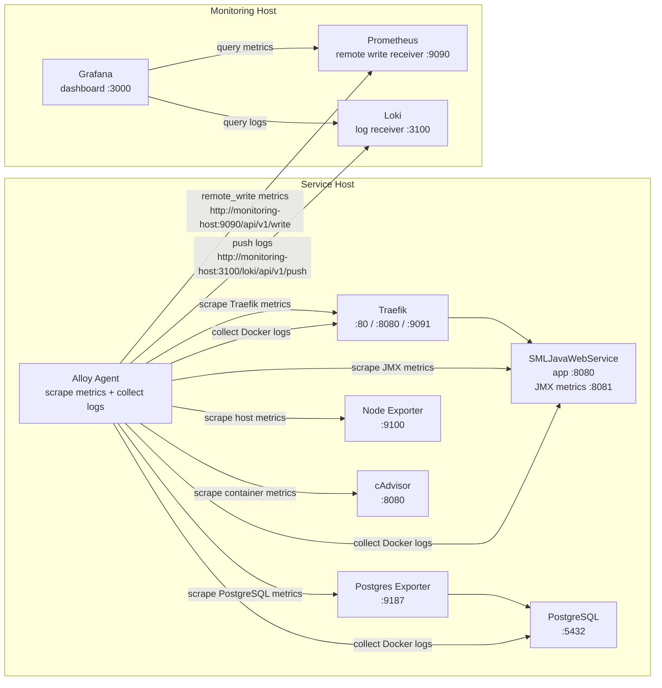

# SML Server Metrics




## purpose 

[x] Setup monitoring host (Prometheus, Grafana, Loki)
[x] Setup metrics+log collector (Alloy)
[ ] Config alloy for collecting Host metrics (CPU, Memory, Disk, Network)
[ ] Config alloy for collecting Web Service metrics (JMX)
[ ] Config alloy for collecting Database metrics (PostgreSQL)
[ ] Config alloy for collecting traffic metrics (Traefik)
[ ] Create a dashboard for monitoring smlerp system (Host, Web Service, Database, traffic)
[ ] Alert when web service is down
[ ] Alert when database is down
[ ] Alert when memory threshold more than 80 percent
[ ] Logging 


## Installation

1. Download JMX Exporter from https://github.com/prometheus/jmx_exporter and place it in the `conf` folder.
2. Create data directory for grafana 
```
mkdir grafana-data
chown 472:472 grafana-data
```
3. Start the containers
```
docker-compose up -d
```
4. Access Grafana at http://localhost:3000
5. Add Prometheus as a data source
6. Import the dashboard from https:/na.com/grafana/dashboards/11376/grafa

## Metrics

JMX - http://192.168.2.213:8081/metrics
PostgreSQL - http://192.168.2.213:9187/metrics
Prometheus - http://192.168.2.213:9090/metrics

## Grafana

http://192.168.2.213/grafana

## Prometheus

http://192.168.2.213:9090


Force Recreate alloy containers
```
docker compose up -d --force-recreate alloy
```