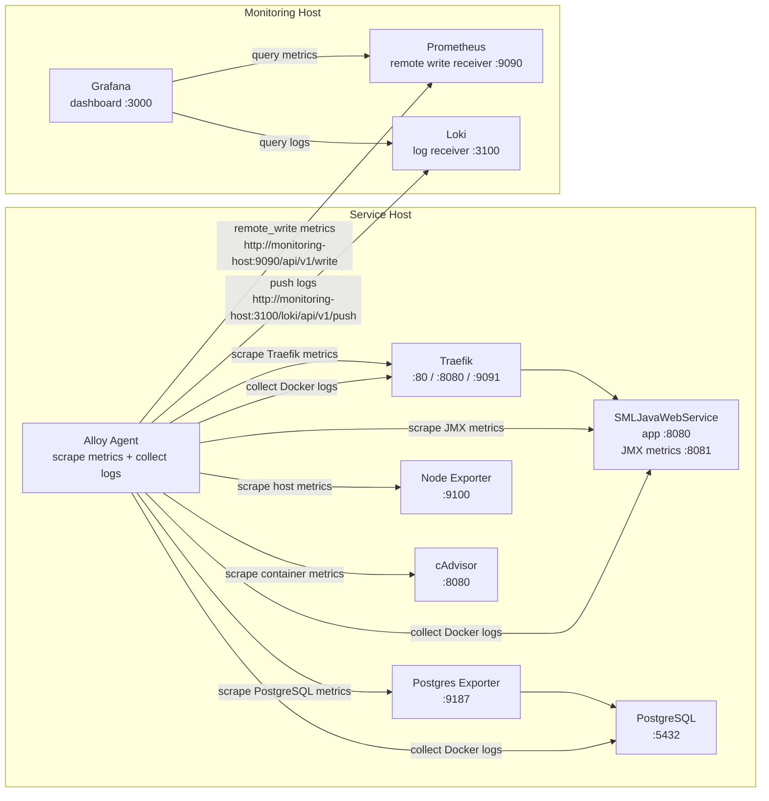

# SML Server Metrics




## purpose 

[x] Setup monitoring host (Prometheus, Grafana, Loki)
[x] Add persistent storage for Prometheus metrics
[x] Add persistent storage for Loki logs
[x] Setup metrics+log collector (Alloy)
[x] Config alloy for collecting Host metrics (CPU, Memory, Disk, Network)
[x] Config alloy for collecting Web Service metrics (JMX)
[x] Config alloy for collecting Database metrics (PostgreSQL)
[x] Config alloy for collecting traffic metrics (Traefik)
[x] Create dashboards for monitoring smlerp system (Host, Web Service, Database, traffic)
[x] Logging pipeline (Alloy -> Loki)
[ ] Provision Loki datasource in Grafana
[ ] Add log panels to Grafana dashboard
[ ] Alert when web service is down
[ ] Alert when database is down
[ ] Alert when memory threshold more than 80 percent


## Installation

1. Download JMX Exporter from https://github.com/prometheus/jmx_exporter and place it in the `conf` folder.
2. Create data directory for grafana 
```
mkdir grafana-data
chown 472:472 grafana-data

mkdir loki-data
chown -R 10001:10001 loki-data

mkdir prometheus-data
chown -R 65534:65534 prometheus-data

```
3. Start the containers
```
docker-compose up -d
```
4. Access Grafana at http://host.to/grafana

## Metrics

JMX - http://192.168.2.213:8081/metrics
PostgreSQL - http://192.168.2.213:9187/metrics
Traefik - http://192.168.2.213:9091/metrics

Prometheus - http://192.168.2.213:9090/metrics

## Grafana

http://192.168.2.213/grafana

## Prometheus

http://192.168.2.213:9090


Force Recreate alloy containers
```
docker compose up -d --force-recreate alloy
```


## Autoheal

```
docker inspect --format='{{json .State.Health}}' sml_webservice
docker logs autoheal --tail=100
```
